# MakerLab - 3D Baskı ve Elektronik Atölyesi Yönetim Sistemi

## Proje Açıklaması

MakerLab; bir okul/üniversite atölyesinde 3D baskı taleplerinin, cihazların,
stok malzemelerinin ve kullanıcıların yönetildiği web tabanlı bir yönetim
sistemidir. Öğrenciler baskı talebi oluşturur, teknisyenler talepleri onaylayıp
cihazlara atar, yöneticiler ise cihaz/stok/kullanıcı yönetimini yapar.

Uygulama Python ve FastAPI ile yazılmıştır; sunucu tarafı şablonlar (Jinja2) ile
HTML üretir ve Microsoft SQL Server veritabanı kullanır. Kimlik doğrulama JWT
tabanlıdır ve token httponly cookie içinde saklanır.

## Projenin Amacı

Atölye süreçlerini (talep alma, onay, cihaz atama, stok takibi, loglama) tek bir
yerden, rol bazlı yetkilendirme ile yönetmek. Manuel takip yerine; talep
sıralaması, cihaz durumu ve stok bilgisini dijital ortamda tutarak hata ve
karışıklığı azaltmak.

## Kullanılan Teknolojiler

- **Python 3**
- **FastAPI** - web çatısı (REST + sunucu tarafı render)
- **Uvicorn** - ASGI sunucusu
- **Jinja2** - HTML şablon motoru
- **Microsoft SQL Server** - veritabanı (`pyodbc` sürücüsü ile)
- **python-jose** - JWT token üretimi/çözümü
- **passlib** - şifre hashleme (SHA-256)
- **python-multipart** - form ve dosya yükleme desteği
- **HTML / CSS** - arayüz (statik `style.css`)

## Özellikler

- Rol bazlı paneller: **Yönetici**, **Teknisyen**, **Öğrenci**
- JWT ile güvenli giriş/çıkış (httponly cookie)
- Öğrenci: STL/3D dosya yükleyerek baskı talebi oluşturma, düzenleme, silme
- "Aynı anda en fazla 3 beklemede talep" kuralı ve **tahmini bitiş tarihi** bilgisi
- Öğrenci için cihaz listesi ve müşteriyi bilgilendiren **kısa açıklamalar**
- Teknisyen: talep onaylama/reddetme, cihaza atama, baskı tamamlama, cihaz durumu güncelleme
- Yönetici: cihaz ekleme/silme/açıklama düzenleme, stok ve kullanıcı yönetimi, sistem logları
- Malzeme rezervasyonu ve stok düşümü
- JSON API uç noktaları (`/api/cihazlar`, `/api/talepler`, `/api/stok`)

## Kurulum Adımları

1. **Depoyu klonlayın:**
   ```bash
   git clone <depo-adresi>
   cd MakerLab
   ```

2. **Sanal ortam oluşturun ve etkinleştirin (Windows):**
   ```bash
   python -m venv .venv
   .venv\Scripts\activate
   ```

3. **Bağımlılıkları yükleyin:**
   ```bash
   pip install -r requirements.txt
   ```

4. **Veritabanını hazırlayın:**
   - Microsoft SQL Server üzerinde `MakerLabDB` veritabanını oluşturun.
   - Gerekli tablolar: `Kullanicilar`, `Roller`, `Kullanici_Rolleri`, `Cihazlar`,
     `Is_Talepleri`, `Is_Atamalari`, `Stok_Malzemeleri`, `Stok_Kategorileri`,
     `Sistem_Loglari`.
   - ODBC `SQL Server` sürücüsünün kurulu olduğundan emin olun.

5. **Bağlantı ayarlarını yapın:**
   - Bağlantı dizesi ve gizli anahtar [app/config.py](app/config.py) içinde tanımlıdır.
   - İsterseniz ortam değişkeni ile geçersiz kılabilirsiniz:
     - `MAKERLAB_DB_CONNECTION` - SQL Server bağlantı dizesi
     - `MAKERLAB_SECRET_KEY` - JWT imzalama anahtarı

## Çalıştırma Adımları

```bash
python run.py
```

Alternatif (otomatik yeniden yükleme ile geliştirme):

```bash
uvicorn app.main:app --reload
```

Ardından tarayıcıdan şu adrese gidin: `http://127.0.0.1:8000`

Giriş yaptıktan sonra rolünüze göre ilgili panele yönlendirilirsiniz:
- Yönetici -> `/admin`
- Teknisyen -> `/teknisyen`
- Öğrenci -> `/ogrenci`

## Ekran Görüntüleri

### Giriş

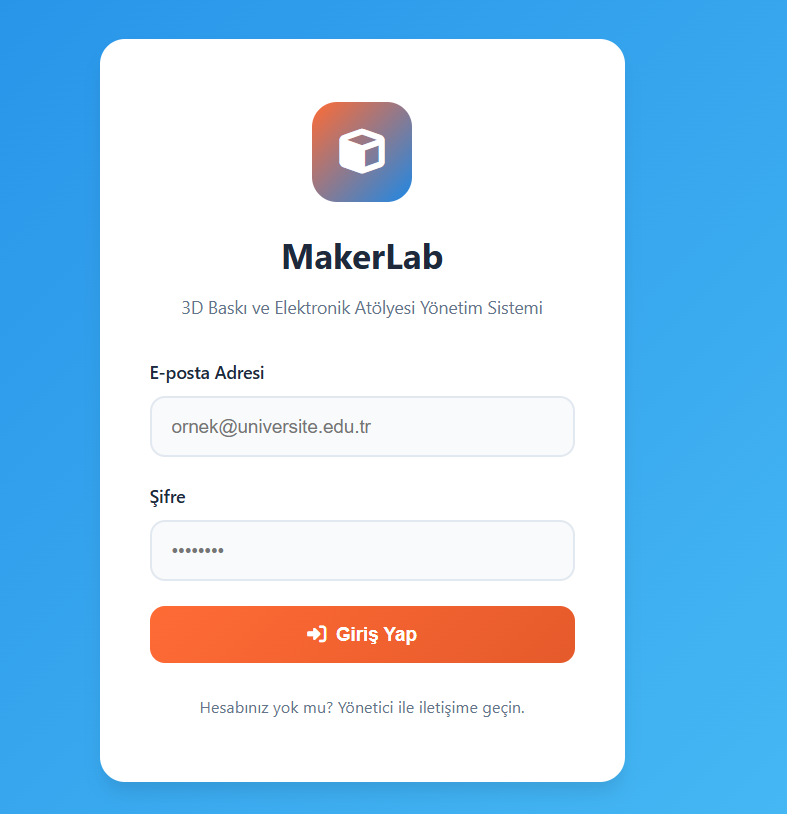

### Öğrenci Paneli

Yeni baskı talebi formu:

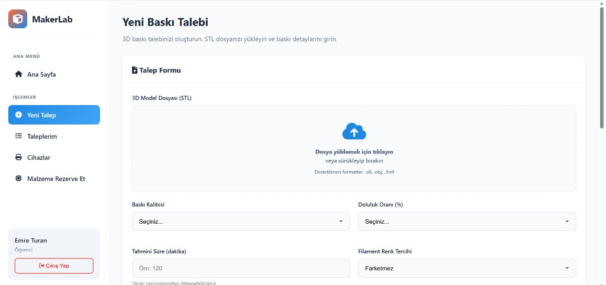

Son talepler ve tahmini bitiş tarihleri:

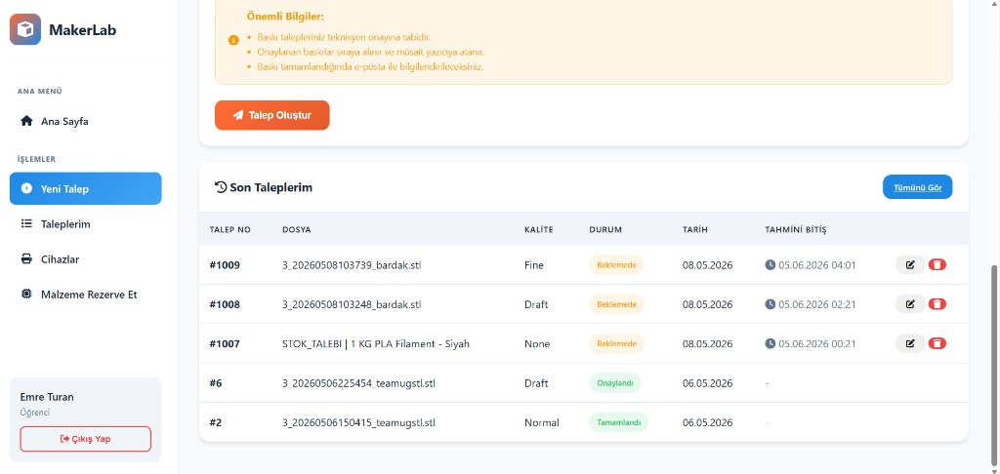

Tüm talep geçmişi:

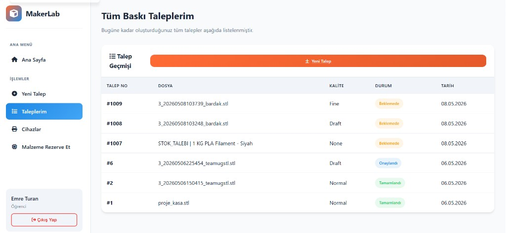

Malzeme rezervasyonu:

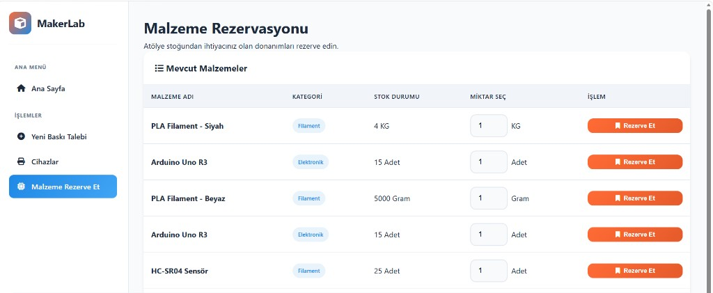

### Teknisyen Paneli

Genel bakış (bekleyen talepler, cihaz ve stok durumu):

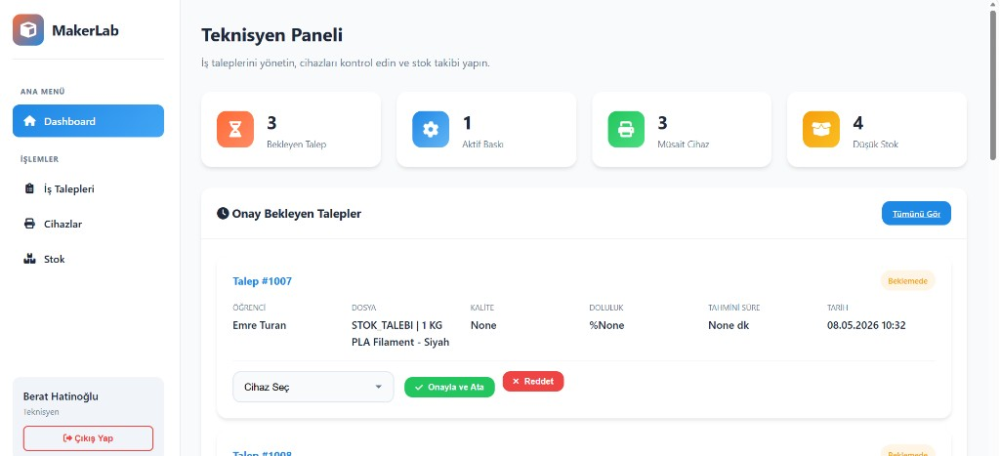

Tüm iş talepleri:

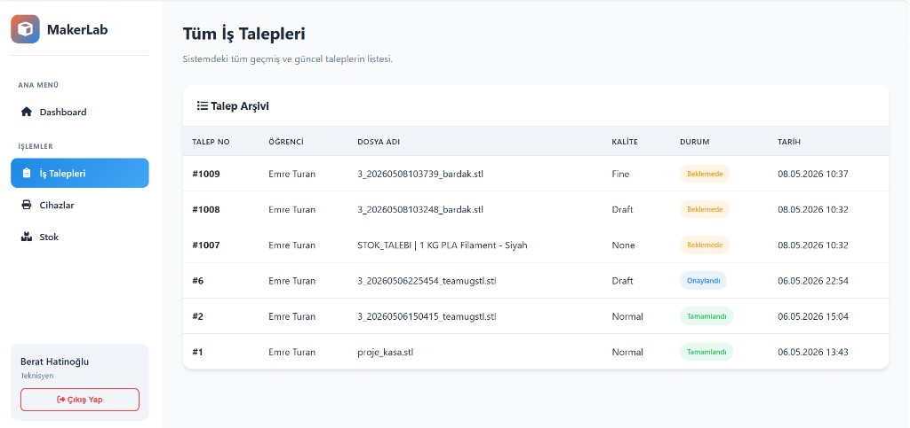

Stok takibi:

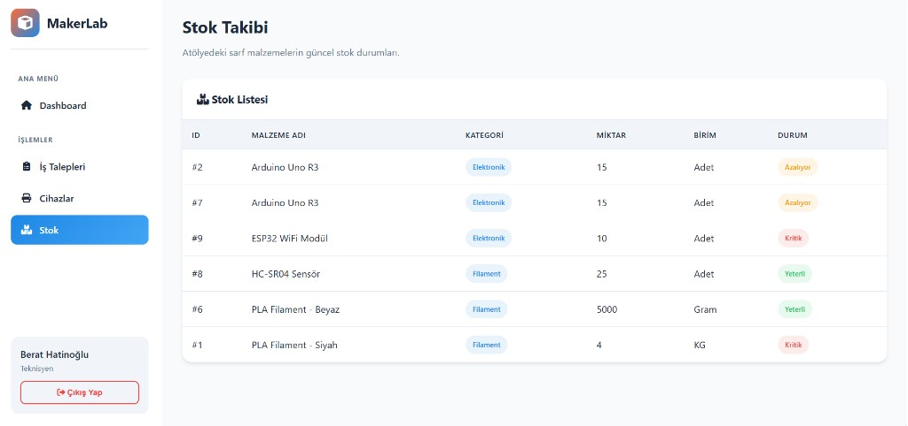

### Yönetici Paneli

Genel bakış:

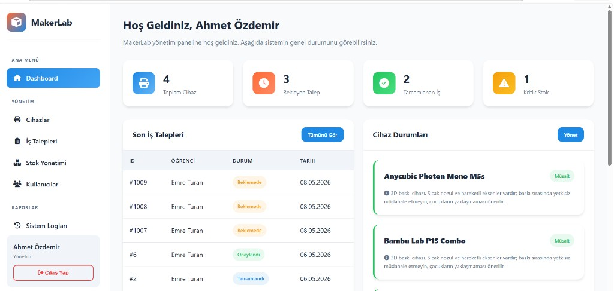

Cihaz yönetimi (müşteri bilgilendirme açıklamalarıyla):

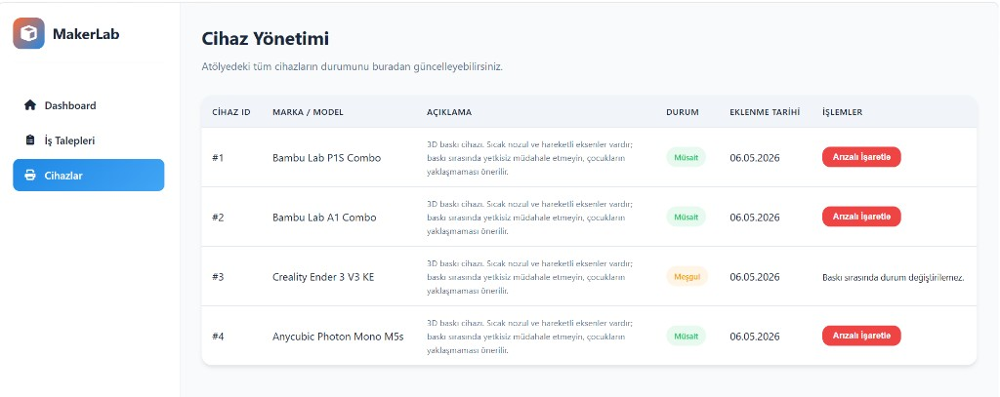

Stok ve envanter yönetimi:

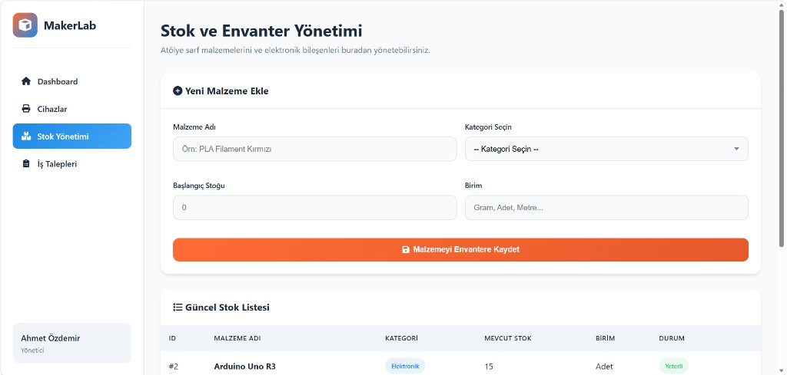

Kullanıcı yönetimi:

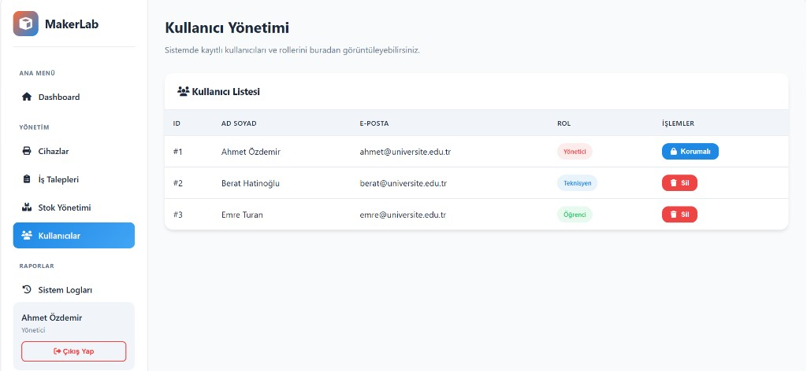

Sistem logları:

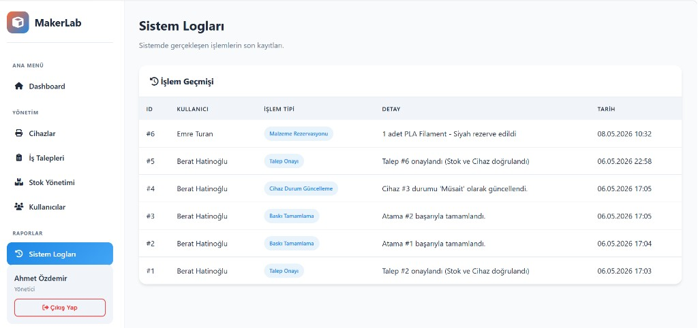

## Klasör Yapısı

```
MakerLab/
├── app/
│   ├── __init__.py
│   ├── main.py            # FastAPI uygulaması, router include, lifespan
│   ├── config.py          # Ayarlar/sabitler (DB, SECRET_KEY, yollar)
│   ├── database.py        # Bağlantı (context manager) ve şema bakımı
│   ├── auth.py            # Şifre hash, JWT, oturum çözümleme
│   ├── helpers.py         # Ortak yardımcılar (dönüştürme, hesaplama, hata)
│   ├── templating.py      # Paylaşılan Jinja2 yapılandırması
│   └── routers/
│       ├── auth.py        # /  /login  /logout
│       ├── admin.py       # /admin/*
│       ├── ogrenci.py     # /ogrenci/*
│       ├── teknisyen.py   # /teknisyen/*
│       └── api.py         # /api/*  /indir/{dosya_adi}
├── templates/             # Jinja2 HTML şablonları
├── static/                # CSS ve statik dosyalar
├── uploads/               # Yüklenen 3D dosyalar (içerik git'e dahil değil)
├── screenshots/           # README için ekran görüntüleri
├── docs/                  # Ek dokümantasyon
├── run.py                 # Giriş noktası (python run.py)
├── requirements.txt
├── .gitignore
└── README.md
```

## Geliştirme Önerileri

- Gizli ayarların (`SECRET_KEY`, DB bağlantısı) `.env` dosyasına taşınması
- SQL sorgularının bir veri erişim (repository) katmanında toplanması
- Pydantic modelleri ile giriş doğrulamasının güçlendirilmesi
- Veritabanı şemasını oluşturan bir kurulum/migration betiği eklenmesi
- Birim ve entegrasyon testleri (pytest) eklenmesi
- Talep sıralaması/tahmini sürenin gerçek cihaz doluluğuna göre hesaplanması
- Arayüzde sayfalama ve arama/filtreleme

## Katkıda Bulunan Kişi(ler)

- Aybüke Sude Emek
- Fatma Mihran Özdemir
- Meryem Efil
- Sude Çakır
